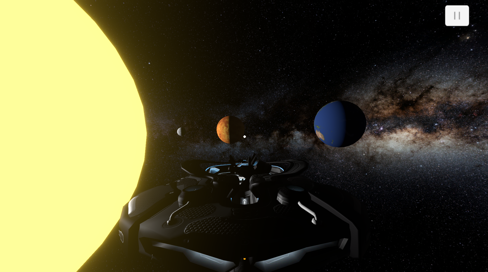
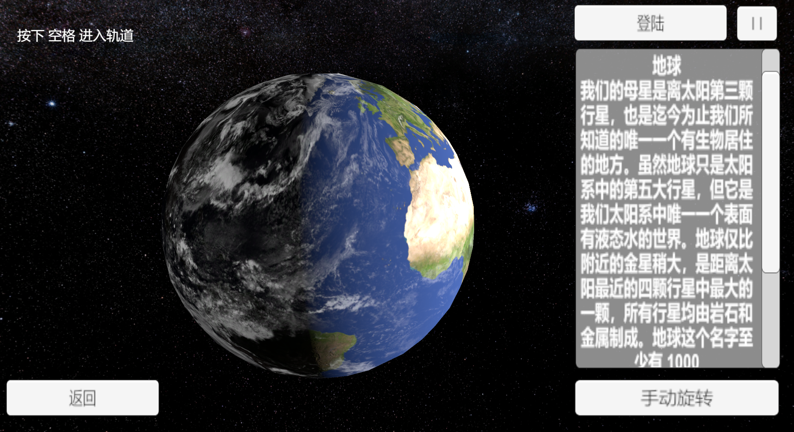

# Version

Unity Version: 2020.3.36f1c1

# Introduction

A simple Unity game that simulate the solar system.

课程实践做的一个模拟太阳系的Unity小游戏,你可以使用飞船移动来查看太阳系中的各个星球。

飞船拥有两种驾驶模式，一种更加真实，是通过给与不同方向的力，以实现移动，但操作可能会变的比较不方便。
另一种则是普遍的移动方式，让飞船在太空中能够身轻如燕、穿梭自如。

太阳的效果用了Unity官方的UBR渲染管线制作。

当靠近星球后可以查看星球的介绍信息

# Thanks

飞船模型来自于[turbosquid](https://www.turbosquid.com/3d-models/starship-stars-max-free/1059750)

星球贴图来自于[solarsystemscope](https://www.solarsystemscope.com/textures/)

skybox贴图来自于[Asset Store](https://assetstore.unity.com/packages/2d/textures-materials/milky-way-skybox-94001)
